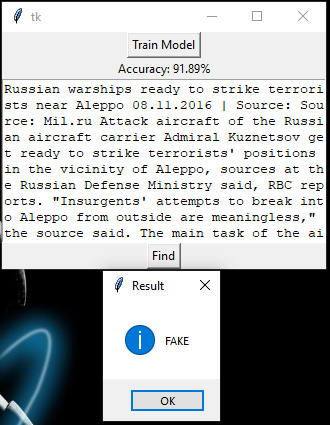
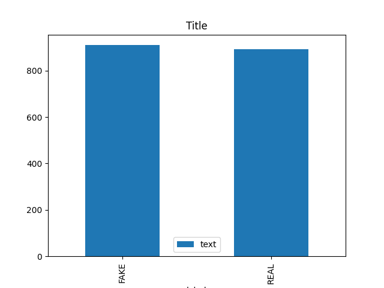
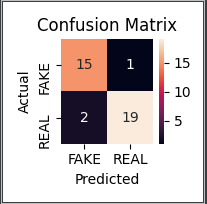

# Fake_news_detection
I have used PassiveAggressiveClassifier from sklearn 
PassiveAggressiveClassifier:-Passive-Aggressive algorithms are generally used for large-scale learning. It is one of the few ‘online-learning algorithms.

Code was pretty simple to understand.

# packages
pip install pandas 
pip install numpy 
pip install sklearn 
pip install tkinter 
pip install matplotlib 

# How to use
<ol>
<li>python det.py(Run the program).</li>
<li>Click on Train button and wait.</li>
<li>After finishing training then copy any text(news) from test.csv and fill in Textbox.</li>
<li>Click on Find Button.</li>
</ol>

# Screenshots
 
 

# Dataset which i have used
<a href="https://www.kaggle.com/c/fake-news/data">
Here is full dataset(from kaggle)
</a>